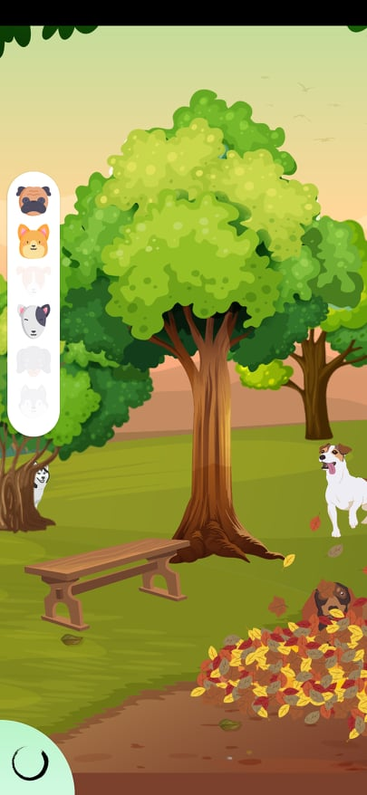

Kalm is a simple app, and the name speaks for itself. It's supposed to make you calm, 
especially if you're experiencing a panic attack. More of a PoC than actual product, but I've learned some useful things during production.

Used components:
- MediaPlayer
- ViewModel
- Navigation 
- ViewBinding

Some screenshots:

